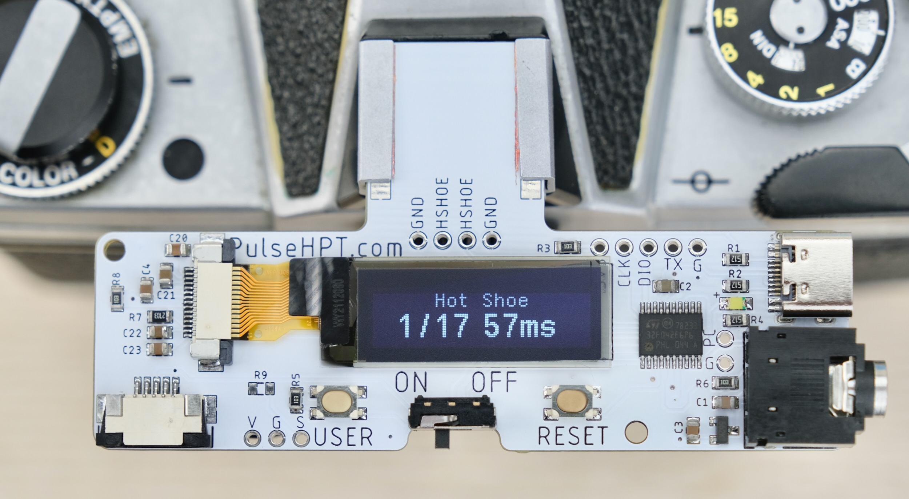
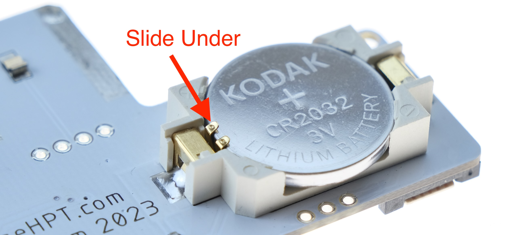
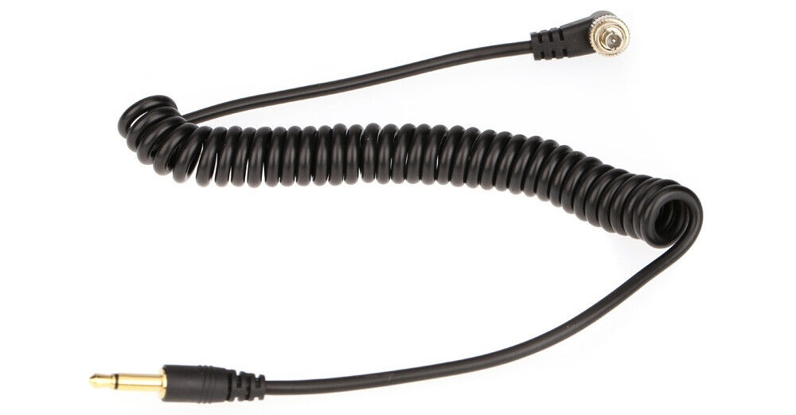
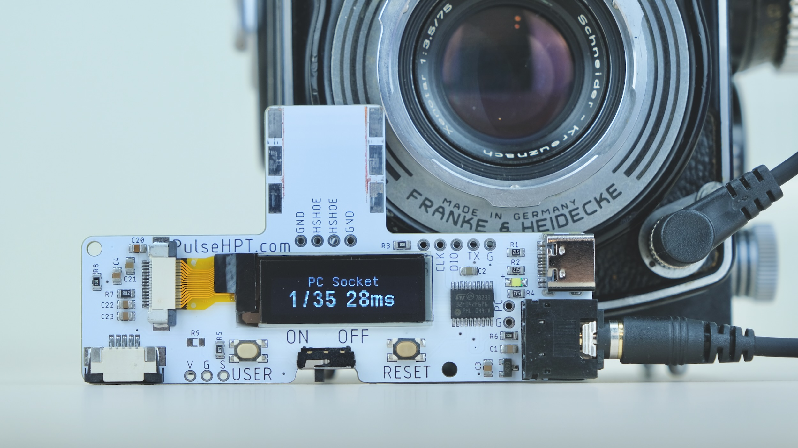

# PulseHPT 3-in-1 Shutter Speed Tester

PulseHPT is a compact shutter speed tester for vintage cameras.

It can measure from three sources:

* Hot Shoe

* PC Socket

* Light Sensor

## Buy One / Discussions

UK Buyer: Ebay Link

Rest of the world: Tindie Link

## Highlights

* Compact & Portable

* Easy to Use: No setup needed.

* Microsecond Accuracy

* Long Battery Life: 20+ hours / 4000+ measurements.

# User Manual

## Battery

* **CR2032**

* Positive (+) side up

* ⚠️ Slide UNDER the catch!

## Measurement: Hot Shoe

Ideal for a quick check on an unknown camera

* Insert into hot shoe

* Slide switch to ON

* Select a speed **at or slower than 1/30s**

* Wind and release the shutter

* Result is shown

💭 If nothing happens, press down to ensure good contact.

⚠️ Beware of caveats! Read below.

#### How it works

When taking a photo, the flash sync signal activates, and remains active **until shutter is closed**.

Thus the approximate shutter speed can be measured.

#### Caveats

* Flash sync only fires **when shutter is fully open**.

* So at higher shutter speeds, the measured speed can be faster than real speed.

* Works best with earlier mostly-mechanical cameras

* For most accurate result, use the light sensor method.

## Measurement: PC Socket

* Use a common **PC Sync to 3.5mm Jack** Cable

* Plug into PC socket, and the other end in the tester.

* Slide switch to ON

* Select a speed **at or slower than 1/30s**

* Wind and release the shutter

* Result is shown

💭 If nothing happens, apply **GENTLE** pressure on the PC socket to ensure good contact.

⚠️ Same caveats as hot shoe!

## Measurement: Light Sensor

Most accurate, as it measures light through lens directly.

* **SLOWLY and GENTLY** push the tab outwards.

* Insert the ribbon cable **metal contact side up**

* Push the tab back

## Multiple Sources

## External Measurements

