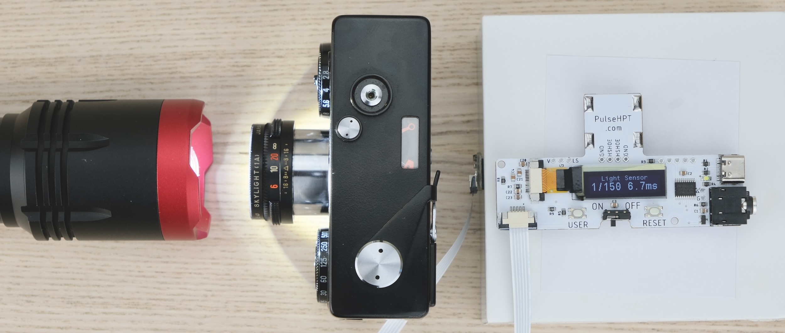

# PulseHPT 3-in-1 Shutter Speed Tester

[Purchase]() | [Discord](https://discord.gg/gyGFqD2vfP) | [Instructions](#user-manual)

---

PulseHPT is a compact shutter speed tester for vintage cameras.

Quick and easy measurement via **Hot Shoe** or **PC socket**.

As well as accurate though-the-lens **light sensor** testing.

## Highlights

* Compact & Portable

* Multiple sources

* Microsecond Accuracy

* 20-hour battery / 4000 measurements

* Ideal for inspecting unknown cameras

## Buy One / Discussions

UK Buyer: Ebay Link

Rest of the world: Tindie Link

[Discord chatroom](https://discord.gg/gyGFqD2vfP) for questions and discussions. Or email `dekuNukem`@`gmail`.`com` .
 
# User Manual

- [Battery](#install-battery)

- [Hot Shoe](#measurement-hot-shoe)

- [PC Socket](#measurement-pc-socket)

- [Light Sensor](#measurement-light-sensor)

## Install Battery

* **CR2032**

* Positive (+) side up

* ⚠️ Slide UNDER the catch!

## Measurement: Hot Shoe

* Insert into hot shoe

* Slide switch to ON

* Select a speed **within flash sync range**

* Wind and release the shutter

💭 If nothing happens, press down to ensure good contact.

⚠️ **Beware of caveats!** Read below.

#### How it works

When taking a photo, the flash sync signal activates, and remains active **until shutter is closed**.

Thus the approximate shutter speed can be measured.

#### Caveats

* Flash sync fires **only when shutter is fully open**.

* Thus at higher speeds, the measured speed can be faster than real speed.

* Works best with earlier mostly-mechanical cameras.

* For most accurate result, use the light sensor method.

## Measurement: PC Socket

* Use a common **PC socket to 3.5mm Jack** Cable

* Plug into PC socket, and the other end in the tester.

* ⚠️ ⚠️ Make sure to use `X Sync` socket / option!

* Slide switch to ON

* Select a speed **within flash sync range**

* Wind and release the shutter

💭 If nothing happens, apply **GENTLE** pressure on the PC socket to ensure good contact.

⚠️ Same caveats as hot shoe!

## Measurement: Light Sensor

Most accurate, but requires some setup.

* Locate the connector on **bottom-left corner**.

* **SLOWLY and GENTLY** push the black tab outwards to unlock.

* Insert the ribbon cable **metal contact side up** all the way in

* Push the tab back in to lock

* **Do the same** on the sensor side

With light sensor connected, let's do a quick test!

* Briefly shine a bright light on the sensor

* Result will be shown

* Now you have an idea how bright the light needs to be

Use double side tape, mount the sensor on a vertical surface, a box or something.

Make sure the sensor is at the **same height as the lens opening**.

* Shine light though the lens

* Largest aperture

* Sensor behind shutter

* Select speed and take a photo

Ensure the light is bright and the sensor is centered for best result.

## USB Firmware Update

PulseHPT can be easily updated for new features and bug fixes.

Instruction will be added when such need arises. 

## Questions or Comments?

[Discord chatroom](https://discord.gg/gyGFqD2vfP) for questions and discussions. Or email `dekuNukem`@`gmail`.`com` .
