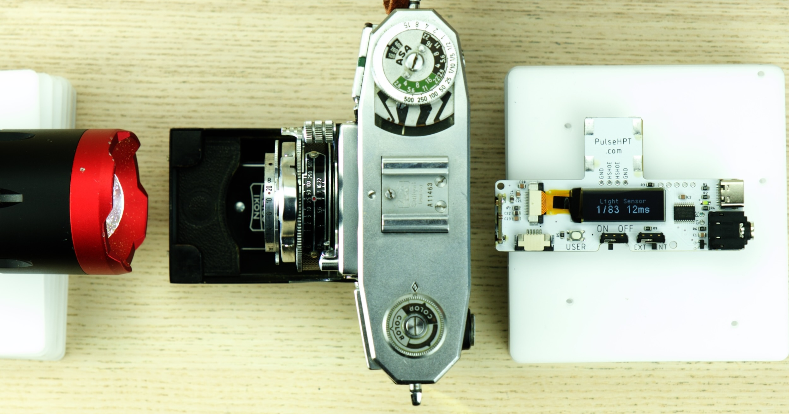
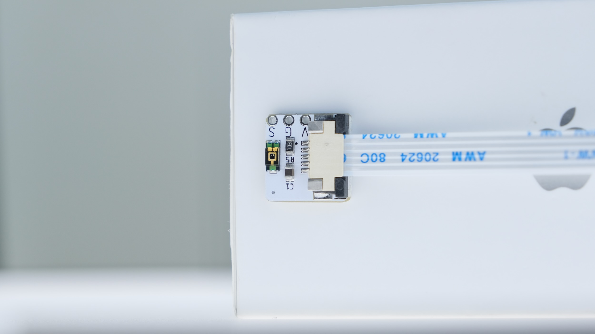
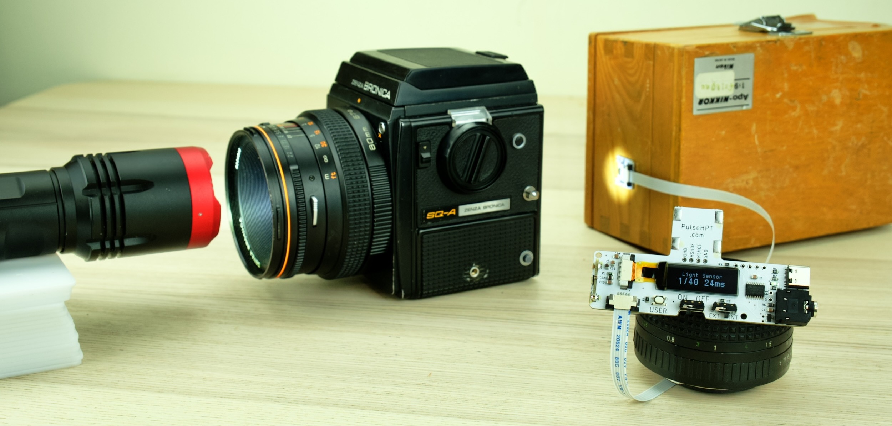

# PulseHPT 3-in-1 Shutter Speed Tester

[Purchase](https://www.tindie.com/products/33002/) | [Discord](https://discord.gg/yyRq8QtX4r) | [Instructions](#user-manual)

---

PulseHPT is a compact shutter speed tester for vintage cameras.

{:loading="lazy"}

Quick and easy measurement from **multiple sources**:

* **Hot Shoe**
* **PC Socket**
* **Light Sensor**
	* Built-in & External
	* Leaf Shutter: All Speeds
	* Focal Plane Shutter: Within Flash Sync

Ideal for **in-the-field testing** of unknown cameras

{:loading="lazy"}

## Highlights

* Compact & Portable

* Multiple Sources

* Microsecond Accuracy

* 20-hour battery / 4000 measurements

## Buy One / Discussions

* United Kingdom: [https://www.ebay.co.uk/itm/364611119604](https://www.ebay.co.uk/itm/364611119604)

* Rest of the world: [https://www.tindie.com/products/33002/](https://www.tindie.com/products/33002/)

[Discord chatroom](https://discord.gg/yyRq8QtX4r) for questions and discussions. Or email `dekuNukem`@`gmail`.`com` .
 
# User Manual

- [Battery](#battery)

- [Hot Shoe](#measurement-hot-shoe)

- [PC Socket](#measurement-pc-socket)

- [Built-in Light Sensor](#measurement-light-sensor)

- [External Light Sensor](#external-light-sensor)

## Battery

* **CR2032**

* Positive (+) side up

* ⚠️ Slide UNDER the catch!

{:loading="lazy"}

## Measurement: Hot Shoe

* Insert into hot shoe

* Slide switch to ON

* Select a speed **within flash sync range**

* Wind and release the shutter

💭 If nothing happens, press down to ensure good contact.

⚠️ **Beware of caveats!** Read below.

{:loading="lazy"}

#### How it works

When taking a photo, the flash sync signal activates, and remains active **until shutter is closed**.

Thus the approximate shutter speed can be measured.

#### Caveats

* Flash sync fires **only when shutter is fully open**.

* Thus at higher speeds, the measured speed can be faster than real speed.

* Works best with earlier mostly-mechanical cameras.

* For most accurate result, use the light sensor method.

## Measurement: PC Socket

* Use a common **PC socket to 3.5mm Jack** Cable

{:loading="lazy"}

* Plug into PC socket, and the other end in the tester.

* ⚠️ ⚠️ Make sure to use `X Sync` socket / option!

{:loading="lazy"}

* Slide switch to ON

* Select a speed **within flash sync range**

* Wind and release the shutter

{:loading="lazy"}

💭 If nothing happens, apply **GENTLE** pressure on the PC socket to ensure good contact.

⚠️ Same caveats as hot shoe!

## Measurement: Light Sensor

* Most accurate
* Two Sources
	* Built-in Sensor: Easiest to Use
	* External Sensor: More Consistent Setup

## Built-in Light Sensor

This feature was added on a recent hardware revision.

Check that your tester has this option.

It should stick out on the left-hand side.

{:loading="lazy"}

Slide light sensor source switch to `INTERAL` position.

{:loading="lazy"}

Shine a bright light into the sensor.

It should trigger and give a measurement.

Now you know how bright the light needs to be.

{:loading="lazy"}

To test:

* Remove lens if possible
* Largest aperture otherwise
* Shine light from front
* Place tester **near the center** of film gate
* Fire shutter
	* Leaf Shutter: All Speeds
	* Focal Plane Shutter: **Within Flash Sync Speed**

{:loading="lazy"}

{:loading="lazy"}

## External Light Sensor

Requires more setup, but can be more consistent, and also suitable for hard-to-reach places.

* Locate the connector on **bottom-left corner**.

* **SLOWLY and GENTLY** push the black tab outwards to unlock.

{:loading="lazy"}

* Insert the ribbon cable **metal contact side up** all the way in

* Push the tab back in to lock

{:loading="lazy"}

* **Do the same** on the sensor side

{:loading="lazy"}

* Slide Source Switch to `EXTERNAL`

{:loading="lazy"}

With light sensor connected, let's do a quick test!

* Briefly shine a bright light on the sensor

* Result will be shown

* Now you know how bright the light needs to be

{:loading="lazy"}

Use double side tape, mount the sensor on a vertical surface, e.g. a box.

{:loading="lazy"}

* Test **without lens** if possible
* Largest aperture otherwise
* Sensor behind shutter
* Shine light
* If possible, use Bulb mode to ensure sensor is at the **center of the light circle**.

{:loading="lazy"}

* Fire shutter
	* Leaf Shutter: All Speeds
	* Focal Plane Shutter: **Within Flash Sync Speed**

{:loading="lazy"}

## Questions or Comments?

[Discord chatroom](https://discord.gg/yyRq8QtX4r) for questions and discussions. Or email `dekuNukem`@`gmail`.`com` .
