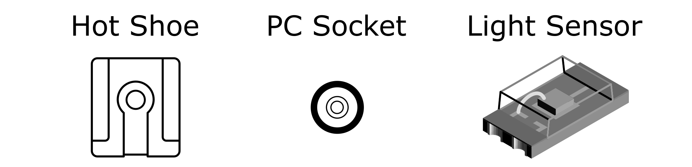

# PulseHPT Shutter Speed Tester

PulseHPT is a compact 3-in-1 shutter speed tester for vintage cameras.

It can measure from three sources:

* Hot Shoe (easiest)

* PC Socket

* Light Sensor (most accurate)

## Highlights

* Compact & Portable

* Easy to Use

* Microsecond Accuracy

* Multiple Sources

## Battery Installation

Insert a CR2032 coin battery positive side up.

Ensure the positive terminal is **ABOVE** the surface.

## Hot Shoe

#### How it works

On a hotshoe, we have the middle trigger pin, and the outer ground plate:

Normally, those two pins are isolated.

However, when taking a photo, those two pins are connected together **when shutter is fully open**.

This triggers the flash, but they also **remain connected until shutter is closed**.

Thus the approximate shutter speed can be measured.

#### Instructions

Insert the tester into the hot shoe.

Turn it on.

Release the shutter

The screen should display the result.

#### Important Notes

As the hotshoe only becomes active **when shutter is fully open**, result at higher shutter speeds might be shorter than it actually is.

Therefore this way is only recommended for speed slower than 1/30 second.

Also, newer cameras might have different shutter design that does not work at all.

## PC Socket

## Light Sensor

## Advanced Usage

---------

The easiest way, although might be incompatible with certain cameras.

shutterbug

mention handles bouncing with state machine

include logic capture

clear button and reset button

clear button clears screen, not required to start new measurement