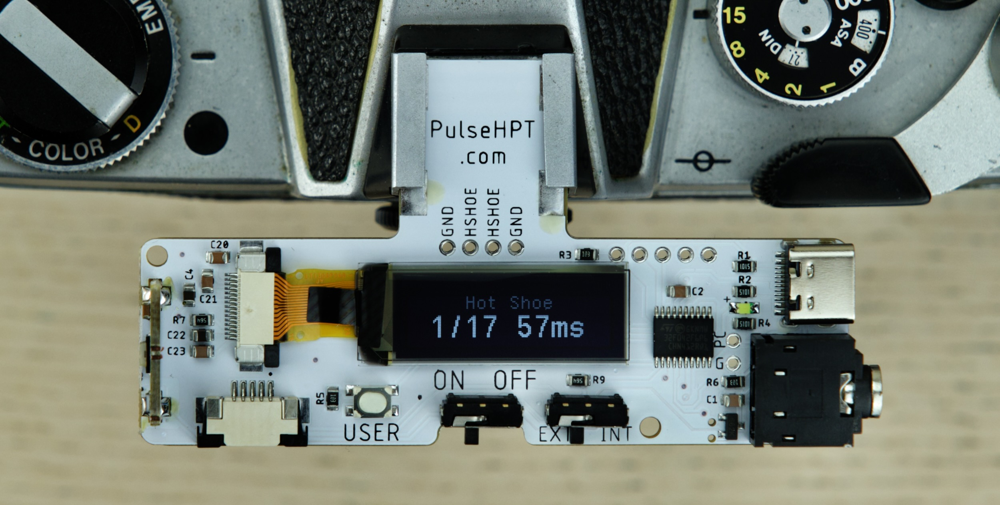
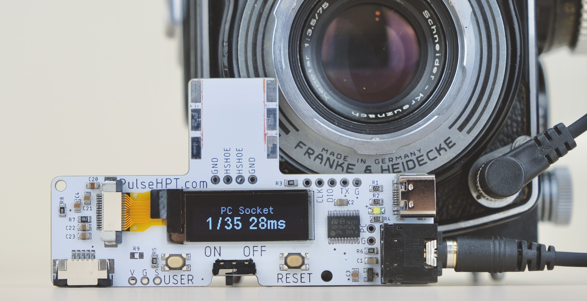

# PulseHPT 3-in-1 Shutter Speed Tester

PulseHPT is a compact shutter speed tester for vintage cameras.

It can measure from three sources:

* Hot Shoe

* PC Socket

* Light Sensor

## Buy One / Discussions

UK Buyer: Ebay Link

Rest of the world: Tindie Link

## Highlights

* Compact & Portable

* Easy to Use: No setup needed.

* Microsecond Accuracy

* Long Battery Life: 20+ hours / 4000+ measurements.

# User Manual

## Battery

Insert a CR2032 coin battery **positive (+) side up**.

Ensure the positive terminal is **ABOVE** the surface.

## Measurement: Hot Shoe

* Insert into hot shoe

* Slide switch to ON

* Select a speed **at or slower than 1/30s**

* Wind and release the shutter

* Result is shown

💭 If nothing happens, press down to ensure good contact.

⚠️ Beware of caveats! Read below.

#### How it works

When taking a photo, the flash sync signal activates, and remains active **until shutter is closed**.

Thus the approximate shutter speed can be measured.

#### Caveats

* Works best with earlier mostly-mechanical cameras

* Ideal for a quick check on an unknown camera

* As flash sync only fires **when shutter is fully open**, at higher shutter speeds, the measured speed can be faster than real speed.

* For most accurate result, use the light sensor method.

## PC Socket

* Use a common **PC Sync to 3.5mm Jack** Cable

* Plug into PC socket, and the other end in the tester.

* Slide switch to ON

* Select a speed **at or slower than 1/30s**

* Wind and release the shutter

* Result is shown

💭 If nothing happens, apply **GENTLE** pressure on the PC socket to ensure good contact.

⚠️ Same caveats as hot shoe!

## Light Sensor

Most accurate method as it measures light through lens directly.

* **SLOWLY and GENTLY** push the tab outwards.

* Insert the ribbon cable **metal contact side up**

* Push the tab back

## Advanced Usage

---------

The easiest way, although might be incompatible with certain cameras.

On a hotshoe, we have the middle trigger pin, and the outer ground plate:

Normally, those two pins are isolated.

However, when taking a photo, those two pins are connected together **when shutter is fully open**.

This triggers the flash, but they also **remain connected until shutter is closed**.

Thus the approximate shutter speed can be measured.

shutterbug

mention handles bouncing with state machine

include logic capture

clear button and reset button

clear button clears screen, not required to start new measurement